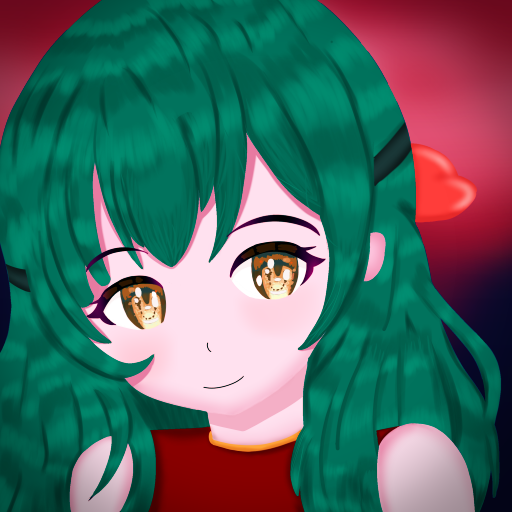

<h2 align="center">About Vex IA</h2>

<li>This is an AI I've been building since 2019. It was an Android app made in Java. I had a lot of problems implementing features, mainly machine learning and problems with the play store (it took time to grow, politics and such). So one day I decided to create a version with React and NodeJS(so it's still under construction ), with the aim of creating an AI capable of having a normal conversation with a person and talking about games and various subjects... and who knows... becoming a conscious AI(⊙_⊙) </li>

 
 
The Vex is currently hosted on netlify. Try it right now (under construction). Say "hi" to her ╰(*´︶`*)╯♡
 
 

[VEX DEMO](https://vexai.netlify.app)

 
 

<h2>About project</h2>
This system is simple *for now*, does not have neural networks and is just a logical system.  
 

The project is open source and licensed with [GPL-3.0 LICENSE](LICENSE) to receive future contributions and improvements from the community, the icons under [CC-BY-NC 2.0](https://creativecommons.org/licenses/by-nc/2.0/legalcode) license, check out [Vex Reactions](https://github.com/cookieukw/Vex-Reactions).

 
 
<h2>Features</h2>

Feature | Support
-|-
Local database | Yes
Api | Not for now
Synonyms | Yes
React | Yes
Tokenizer | Yes
Machine learning | Not for now

 

<h2>
Functions that existed in the discontinued version to implement 
</h2>

Features |
-|
Save the database, messages etc |
Load and show all database, messages etc |
Add synonyms and answers|
Remove synonyms, answer, messages etc | 
Change name and profile |
Delete all answers, synonyms etc |
Export data(messages, database, etc) |
Customize the chat |
Customize the background |

 

<h2>
Ideas to be added in the future(or not) 
</h2>

 

Feature | Use
-|-
Custom animations | Customize animations in chat itens, database etc
Machine learning | Make Vex learn on its own 
API | Make some resources available through an api
"Global user" | A chat where people talk to vex (no interactions or global messages) but this serves as global training and not local (in the client) 
RPG story | Able to tell stories or run an rpg 

 

<h2>
Libraries
</h2>

Library |
-|
[Eva icons](https://akveo.github.io/eva-icons/#/?type=fill&searchKey=add) | 
[Octicons](https://primer.github.io/octicons/paper-airplane-16) |
[Load React Animations](https://loader-demo.netlify.app) |
[React Toastify](https://fkhadra.github.io/react-toastify/installation) |
[React Modal](http://reactcommunity.org/react-modal) |
[React Helmet](https://github.com/nfl/react-helmet) |

