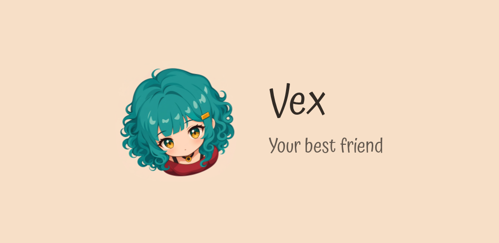

<div align="center">
  
  <h1>Vex AI</h1>
  
  
  
  <p><strong>An ever-evolving artificial intelligence project since 2019.</strong></p>

  <a href="https://vexxx.vercel.app/enUS">
    
  </a>
  <a href="https://github.com/Vex-AI/VexAI_Java">
    
  </a>
  
  <br><br>

  <a href="https://play.google.com/store/apps/details?id=com.cookieukw.vex">
    
  </a>
</div>

---

## 📖 About the Project

Initially developed as an Android app in Java, Vex faced challenges implementing advanced machine learning features natively. The project was completely reborn using **React**, **NodeJS**, and a modern web architecture to shift the heavy lifting to the cloud.

The ultimate purpose of Vex AI is to create an artificial intelligence capable of holding natural, organic conversations, discussing games, pop culture, and various interesting subjects—and who knows, maybe even becoming a conscious AI (⊙_⊙).

**Note:** Vex is under active development. You can try the web version [here](https://vexxx.vercel.app/enUS). Say "hi" to her ╰(*´︶`*)╯♡

---

## ✨ Features

Vex has grown significantly since her early days. Here are some of her core capabilities:

| Feature | Description |
| :--- | :--- |
| **🧠 Gemini Integration** | Powered by Google's Gemini 2.5 Flash/Pro for highly contextual and fast responses. |
| **🎭 VexPsyche (Emotions)** | Simulated "free will". Vex has dynamically shifting moods (Stress, Boredom, Affection) that alter her personality and typing speed! |
| **🛡️ Rate Limit Armor** | Graceful fallback and wait-timers when the API quota is exhausted, preventing app crashes. |
| **💾 Persistent Memory** | All configurations, local intents, and chat histories are securely saved locally via IndexedDB (Dexie). |
| **🎨 Deep Customization** | Change chat bubbles, switch avatars dynamically, and apply system-wide dark/light themes. |
| **🌐 Offline Mode** | Uses a Naive Bayes classifier as a fallback to chat even without an internet connection! |
| **📦 Export / Import** | Complete freedom to export and backup your database of custom synonyms and intents. |

---

## 🛠️ Technologies

Built with modern web and mobile frameworks to ensure blazing fast performance across all devices:

<div align="center">
  <a href="https://react.dev/" target="_blank" rel="noreferrer">
    
  </a>
  <a href="https://vitejs.dev/" target="_blank" rel="noreferrer">
    
  </a>
  <a href="https://tailwindcss.com/" target="_blank" rel="noreferrer">
    
  </a>
  <a href="https://www.typescriptlang.org/" target="_blank" rel="noreferrer">
    
  </a>
</div>

### Core Dependencies

| Library | Version | Description |
| :--- | :--- | :--- |
| `@capacitor/*` | `^8.x` | Native mobile runtime (Android/iOS) wrapping the web app |
| `react` | `^19.x` | Core UI Framework |
| `vite` | `^6.x` | Next-generation frontend tooling and bundler |
| `tailwindcss` | `^4.x` | Utility-first CSS framework for rapid styling |
| `framer-motion`| `^11.x` | Fluid animations and page transitions |
| `zustand` | `^5.x` | Lightweight global state management |
| `dexie` | `^4.x` | Robust IndexedDB wrapper for local storage |
| `lucide-react` | `^0.552`| Beautiful and consistent iconography |
| `@google/generative-ai` | `^0.24` | Official Gemini AI SDK integration |

---

## 🚀 Running Locally

We use `pnpm` as our package manager. To get Vex running on your machine:

1. **Install dependencies:**
   ```sh
   pnpm install
   ```
2. **Start the development server:**
   ```sh
   pnpm run dev
   ```

---

## 🗺️ Future Development Roadmap

| Category | Feature | Description | Impact |
| :--- | :--- | :--- | :--- |
| **Interaction** | Emotion-Driven Animations | Dynamic UI animations that reflect Vex's current mood | ★★★★★ |
| **Technology** | Real-Time Audio | Instant voice interaction and speech synthesis | ★★★★☆ |
| **Advanced AI** | Memory RAG | Vector-based retrieval for long-term memory across sessions | ★★★★★ |
| **Security** | Privacy Guardian | Granular data control with self-destructing conversations | ★★★★☆ |

---

## 📜 License

This project is open source and licensed under the [MIT LICENSE](./LICENSE) to encourage future contributions and improvements from the community.

The icons are licensed under [CC-BY-NC2.0](https://creativecommons.org/licenses/by-nc/2.0/legalcode). Check out [Vex Reactions](https://github.com/cookieukw/Vex-Reactions) for more details.
